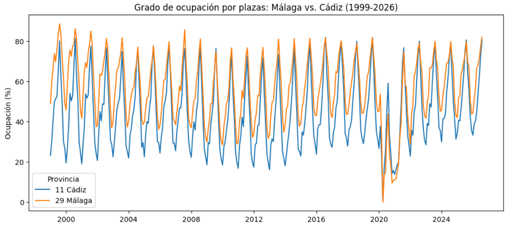
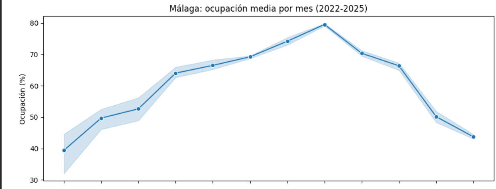
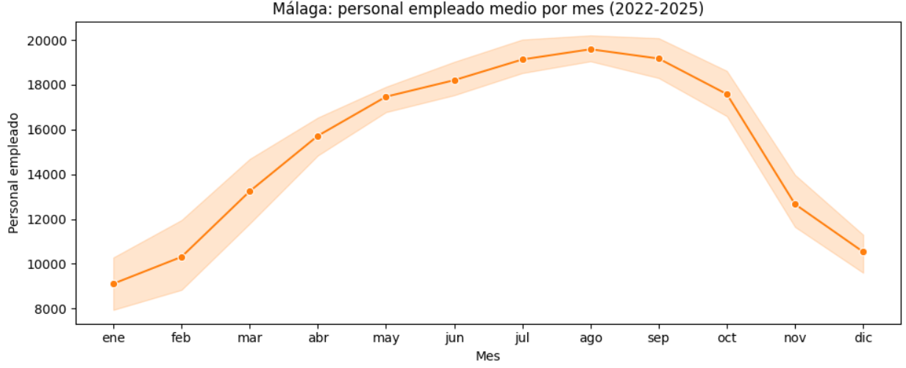
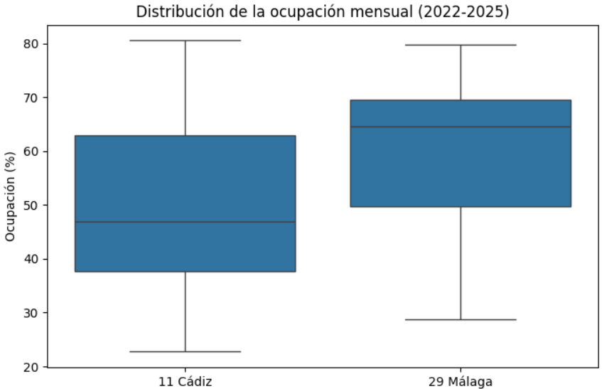

# Del dato crudo a la decisión: ocupación hotelera en Málaga
Es un mini-proyecto para la prueba técnica de formadora Data Analytics. El objetivo es preparar una actividad que muestre el ciclo de vida del dato desde una perspectiva técnica, pedagógica y ética.

**Pregunta principal:** ¿está la capacidad hotelera de Málaga cerca de su límite en temporada alta?

---

## Contenido del repositorio

```
├── DelDatoCrudoALaDecisión-RocíoLozanoCaro.ipynb   #https://colab.research.google.com/drive/1Z5Kn-ls1jgI842740nIgeV5bOtR_f5pH#scrollTo=36gzMiAnAWc_
├── requirements.txt                #Librerías y sus versiones
├── README.md                       #Guía didáctica
├── data/
│   ├── 2066.csv                    #Copia del CSV original
│   └── 2066_limpio.csv             #Dataset tras la limpieza
└── img/                            #Visualizaciones
    ├── visualización1                  
    ├── visualización2
    └── visualización3
```

## Cómo ejecutarlo

1. Abre el notebook en Google Colab.
2. Ejecuta todas las celdas en orden: Ejecutar todo/Run all.
3. El notebook descarga los datos directamente desde la web del INE, así que no hay que subir ningún archivo. Si la web del INE fallara, sube `data/2066.csv` a Colab y cambia la URL por `'2066.csv'` en la celda de carga.
4. En local: `pip install -r requirements.txt`. La librería `missingno` se instala en la primera celda con `%pip install missingno`.

---

## El dataset

- **Fuente:** Encuesta de Ocupación Hotelera (EOH), INE. Tabla 2066: establecimientos, plazas, grado de ocupación y personal empleado por provincia.
- **Enlaces:** [CSV](https://www.ine.es/jaxiT3/files/t/csv_bdsc/2066.csv) · [Tabla en INEbase](https://www.ine.es/jaxiT3/Tabla.htm?t=2066) · [Metadatos](https://www.ine.es/dynt3/metadatos/es/RespuestaDatos.htm?oe=30235) · [Definición de variables (páginas 4 y 5)](https://www.ine.es/daco/daco42/ocuphotel/meto_eoh.pdf)
- **Licencia de los datos:** Creative Commons Reconocimiento 4.0 (CC BY 4.0). *Elaboración propia con datos extraídos del sitio web del INE: www.ine.es.*
- **Unidad de análisis:** provincia × mes (cada fila es una provincia en un mes concreto).
- **Unidades de medida:** varían según la variable: viajeros, pernoctaciones, días, personas, tanto por cien, establecimientos, plazas y habitaciones.
- **Periodo:** 1999-2026, mensual. Última actualización: agosto de 2026. Los datos de enero de 2026 en adelante son provisionales.
- **Tamaño:** Ver sección 3 del notebook.
- **Columnas principales:** `Provincias`, `Periodo`, `Establecimientos y personal empleado (plazas)` (indica la métrica de cada fila) y `Total` (su valor). Como cada fila es una métrica distinta, `Total` cambia de unidad según la métrica.

## Calidad del dato y limpieza

- Los valores `..` del INE significan "dato no disponible": se convierten en nulos y se eliminan.
- `Total` llega como texto en formato español (punto de miles, coma decimal) y se convierte a número.
- `Periodo` (`2010M01`) se separa en `Año` y `Mes`.
- Tras convertir `Total` aparecen 70 nulos nuevos que se eliminan.
- Outliers: los valores altos de ocupación se mantienen porque corresponden a picos reales (ninguno supera el 100 % ni baja del 0 %).
- Antes/después de dimensiones y % de nulos: ver el notebook, sección 3.

## SQL

El dataset limpio se carga en SQLite (`2066.db`, tabla `tabla_2066_limpia`) y se crea una tabla auxiliar `temporadas` donde los meses de verano son temporada alta y el resto baja. Las 4 consultas están en el notebook, sección 5.

1. Ranking de provincias por ocupación media.
2. Meses de mayor ocupación en Málaga.
3. Málaga frente a Cádiz en ocupación y personal empleado.
4. Temporada alta frente a baja en Málaga.

## Visualizaciones

1. Evolución de la ocupación 1999-2026, Málaga frente a Cádiz.
 
2. Estacionalidad en Málaga: ocupación y personal empleado por mes.
 
 
3. Distribución de la ocupación mensual, Málaga frente a Cádiz.
 

**Por qué estos visuales:** línea para la evolución temporal, dos paneles para comparar la estacionalidad de dos variables con escalas distintas, boxplot para comparar la dispersión entre provincias. Se descarta el gráfico circular porque no hay partes de un total que comparar.